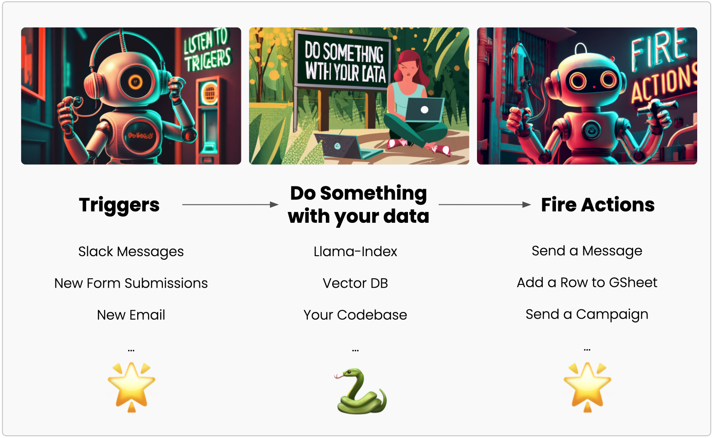

# 👋 Hi there, this is <a href="https://querystar.io/" style="color: #AF3BEA;"> QueryStar</a> 

### Python-first solution to develop bots

QueryStar lets you 
- Automate workflows
- Slack bots




## Install

```
pip install querystar
```

## Get your access token : app.querystar.io

## Add access token to environment variable

## Sample app

```py
# app.py
import querystar as qs

message_info = qs.triggers.slack.new_message()
print(message_info)
```

## Run using

```bash
querystar run app.py
```
